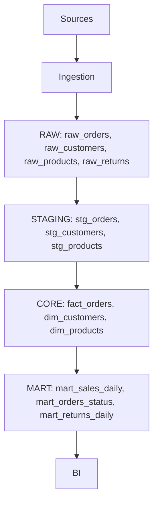

```mermaid
flowchart TD
    A["Sources"] --> B["Ingestion"]
    B --> C["RAW: raw_orders, raw_customers, raw_products, raw_returns"]
    C --> D["STAGING: stg_orders, stg_customers, stg_products"]
    D --> E["CORE: fact_orders, dim_customers, dim_products"]
    E --> F["MART: mart_sales_daily, mart_orders_status, mart_returns_daily"]
    F --> G["BI"]
```
